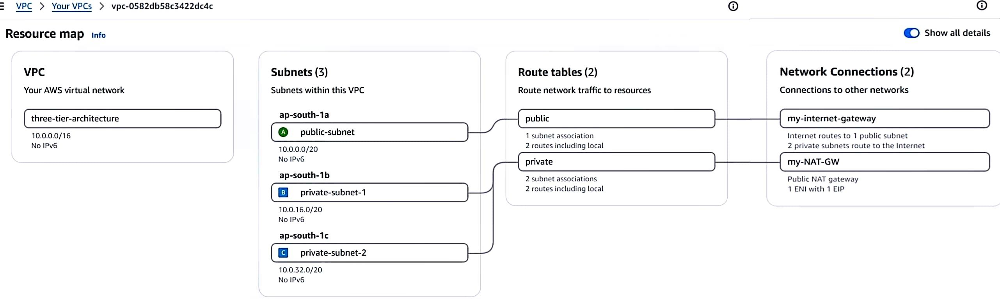
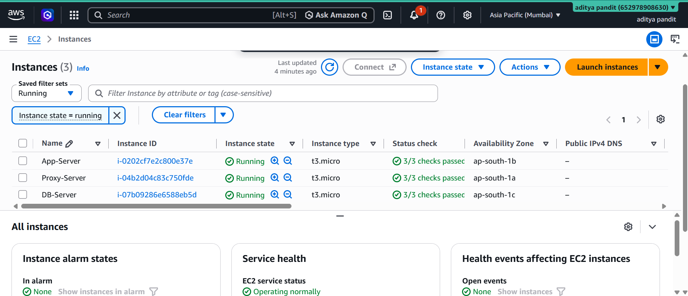
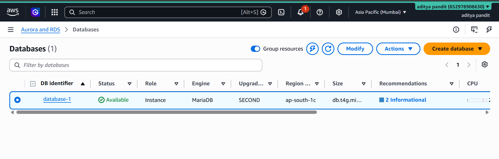
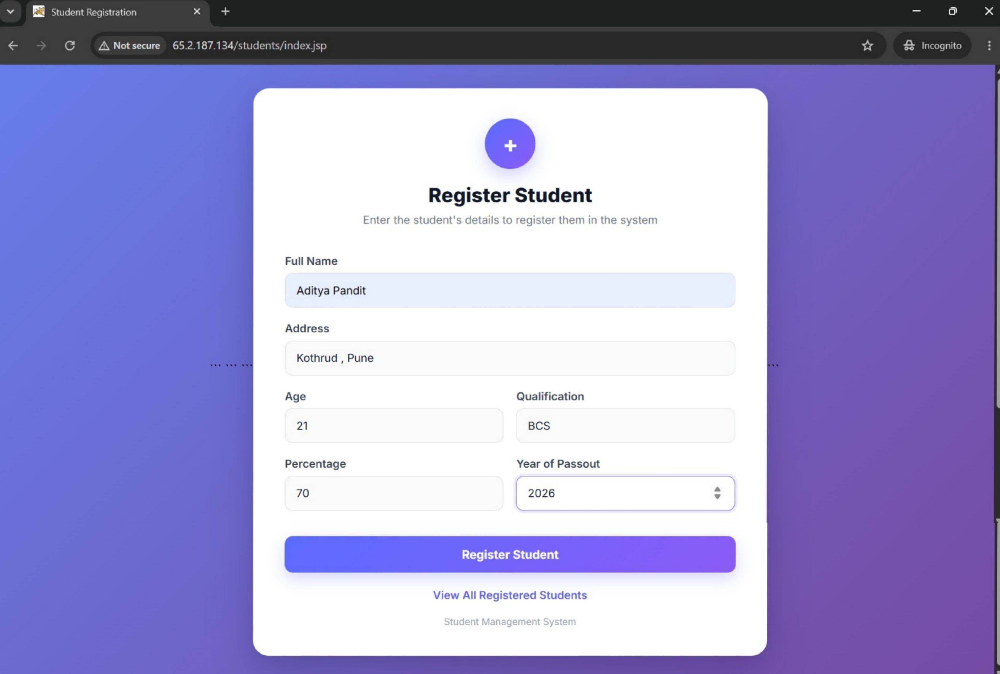
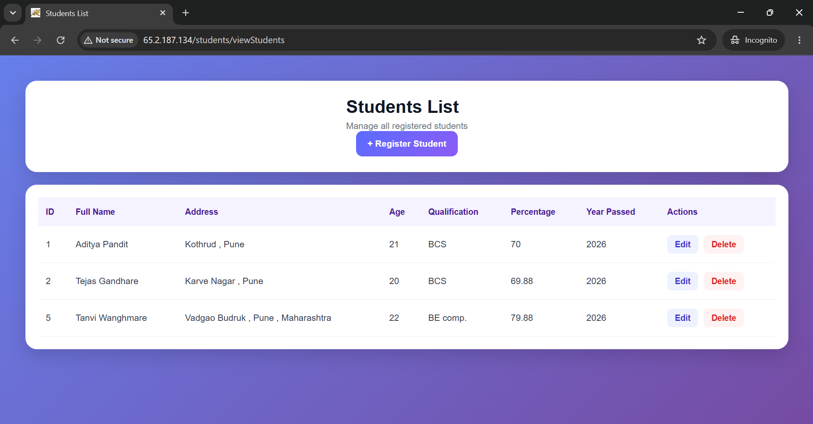
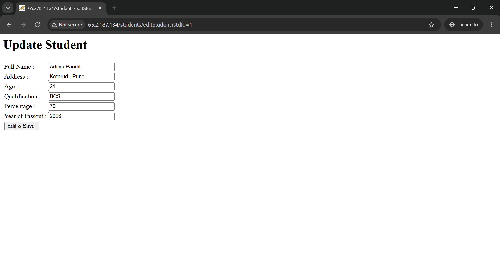
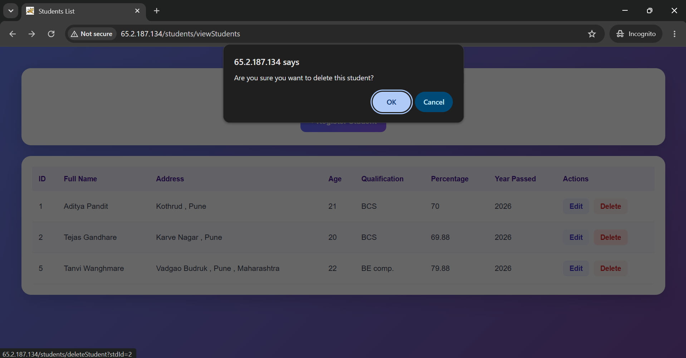

# Java Three-Tier-Project - Student Management Application

A Student Management web application deployed on a **3-tier AWS architecture** — Proxy Server → App Server → Database — with each tier isolated in its own subnet for security.


---

## 📑 Table of Contents

- [Tech Stack](#-tech-stack)
- [Architecture](#-architecture)
- [Features](#-features)
- [Infrastructure Details](#-infrastructure-details)
- [Application Deployment](#-application-deployment)
- [Project Structure](#-project-structure)
- [Skills Demonstrated](#-skills-demonstrated)
- [Screenshots](#-screenshots)
- [Author](#-author)

---

## 🛠 Tech Stack

| Layer | Technology |
|---|---|
| Frontend | JSP, HTML, CSS |
| Backend | Java Servlets, JDBC |
| Application Server | Apache Tomcat |
| Database | Amazon RDS (MySQL) |
| Infrastructure | AWS VPC, EC2, NAT Gateway, Internet Gateway |
| Build Tool | Maven |
| Version Control | Git, GitHub |

---

## 🏗 Architecture

A custom VPC (`10.0.0.0/16`) spans 3 subnets across different Availability Zones, separating the public-facing proxy from the private application and database layers.

```
                         INTERNET
                             │
                             ▼
                    ┌────────────────┐
                    │ Internet       │
                    │ Gateway        │
                    └───────┬────────┘
                            │
                            ▼
                 ┌──────────────────────┐
                 │   PUBLIC SUBNET      │   10.0.0.0/20 · ap-south-1a
                 │   Proxy Server       │
                 └──────────┬───────────┘
                            │ application traffic
                            ▼
                 ┌──────────────────────┐
                 │   PRIVATE SUBNET 1   │   10.0.16.0/20 · ap-south-1b
                 │   App Server         │
                 │   (Tomcat + Java)    │
                 └──────────┬───────────┘
                            │ database traffic
                            ▼
                 ┌──────────────────────┐
                 │   PRIVATE SUBNET 2   │   10.0.32.0/20 · ap-south-1c
                 │   Amazon RDS (MySQL) │
                 └──────────────────────┘
```

**Traffic flow:** Internet → Proxy Server (public) → App Server (private) → RDS Database (private). The database is never directly reachable from the internet; private-subnet resources reach the internet outbound only, via the NAT Gateway.

---

## ✨ Features

- Student registration
- View all student records
- Edit student records
- Delete student records

---

## 🌐 Infrastructure Details

<details>
<summary><b>VPC & Subnets</b></summary>

| Subnet | CIDR | Availability Zone | Purpose |
|---|---|---|---|
| public-subnet | 10.0.0.0/20 | ap-south-1a | Proxy Server |
| private-subnet-1 | 10.0.16.0/20 | ap-south-1b | App Server |
| private-subnet-2 | 10.0.32.0/20 | ap-south-1c | Amazon RDS |

VPC Name: `three-tier-architecture` · VPC CIDR: `10.0.0.0/16`

</details>

<details>
<summary><b>EC2 Instances</b></summary>

| Instance | Type | Subnet | Role |
|---|---|---|---|
| Proxy-Server | t3.micro | public-subnet | Public entry point, forwards traffic to App Server |
| App-Server | t3.micro | private-subnet-1 | Runs Apache Tomcat + the Java application |
| — | — | private-subnet-2 | Amazon RDS (MySQL) — managed database instance |

App deployed at: `/opt/tomcat/webapps/students/`

</details>

<details>
<summary><b>Internet Gateway & NAT Gateway</b></summary>

**Internet Gateway** (`my-internet-gateway`) — attached to the VPC, gives the public subnet two-way internet access via the public route table.

**NAT Gateway** (`my-NAT-GW`) — sits in the public subnet; private subnets route outbound-only traffic (e.g. package installs, updates) through it. Nothing from the internet can initiate a connection back to the private instances through NAT.

</details>

<details>
<summary><b>Route Tables</b></summary>

**Public route table** — associated with `public-subnet` → routes `0.0.0.0/0` to the Internet Gateway.

**Private route table** — associated with `private-subnet-1` and `private-subnet-2` → routes outbound `0.0.0.0/0` to the NAT Gateway.

</details>

<details>
<summary><b>Security Model</b></summary>

Each tier only accepts traffic from the tier directly before it:

```
Internet → Proxy Server → App Server → Amazon RDS
```

Security Groups enforce this — e.g. RDS's inbound rule allows port 3306 only from the App Server's Security Group, not from any public IP or CIDR.

</details>

---

## 🚀 Application Deployment

Java, Apache Tomcat, and the application were set up on the App Server:

```bash
java -version        # verify Java
javac -version        # verify JDK (compiler)
```

Tomcat installed under `/opt/tomcat/`. The application WAR was extracted into:
```
/opt/tomcat/webapps/students/
```

The database connection is configured as a JNDI DataSource in Tomcat's `context.xml`, pointing to the Amazon RDS endpoint over JDBC:

```
Browser → Proxy Server → App Server (JDBC) → Amazon RDS (MySQL)
```

---

## 📁 Project Structure

```
Java-Three-Tier-Student-Management-Project/
│
├── WebContent/
│   ├── index.jsp
│   ├── home.jsp
│   └── WEB-INF/
│       └── web.xml
│
├── screenshots/
│
├── src/
│   ├── com/srk/
│   │   ├── dao/
│   │   │   └── StudentDAO.java
│   │   └── servlet/
│   │       ├── RegistrationController.java
│   │       ├── ViewStudents.java
│   │       ├── EditStudent.java
│   │       ├── SaveEditedStudent.java
│   │       └── DeleteStudent.java
│   │
│   └── vo/
│       └── Student.java
│
├── pom.xml
├── .gitignore
└── README.md
```

Build the WAR with Maven:
```bash
mvn clean package
```

---

## 📚 Skills Demonstrated

`AWS VPC` · `Subnet Design` · `Public/Private Subnets` · `Route Tables` · `Internet Gateway` · `NAT Gateway` · `EC2` · `Security Groups` · `Amazon RDS` · `Linux Administration` · `SSH` · `Apache Tomcat` · `WAR Deployment` · `JDBC` · `Three-Tier Architecture` · `Git & GitHub` · `Maven` · `Application Troubleshooting`

---

## 📸 Screenshots

### AWS Infrastructure

**VPC Resource Map**


**EC2 Instances**


**Amazon RDS Database**


### Application

**Student Registration Form**


**Students List**


**Edit Student**


**Delete Student**


---

## 👤 Author

**Aditya Pandit**
GitHub: [github.com/adityapandit5552](https://github.com/adityapandit5552)
